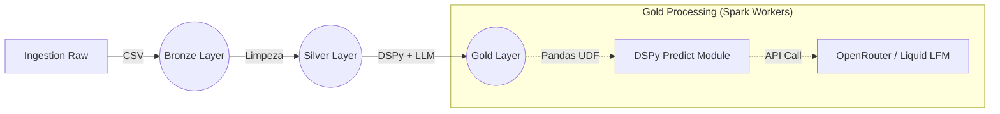

Aqui está o código completo do **README.md** em formato Markdown puro.

Você pode copiar o bloco abaixo inteiro e colar no seu arquivo `README.md`.

```markdown
# DSPy Databricks Learning

> **Exploração prática de Pipelines de Engenharia de Dados com IA Generativa, integrando DSPy, Spark (Delta Live Tables) e OpenRouter.**

Este repositório documenta a jornada de implementação de um pipeline **Medallion Architecture** (Bronze → Silver → Gold) no Databricks, onde a camada final utiliza LLMs para realizar inferência estruturada em escala.

---

## 🏗️ Arquitetura do Projeto

O projeto utiliza o **Delta Live Tables (DLT)** para orquestração e linhagem de dados. O fluxo de dados é desenhado da seguinte forma:



### 🧩 Camadas

* **Ingestion Raw & Bronze** (`ingestion_raw.py`):
* Leitura de arquivos CSV brutos (Reviews de E-commerce).
* Ingestão inicial para tabela Delta com schema inferido.


* **Silver** (`true_feel.py`):
* Padronização de colunas e limpeza básica.
* Preparação dos textos para análise.


* **Gold** (`gold_layer.py`):
* **Core do Projeto:** Aplicação de IA Generativa distribuída.
* Uso de **Pandas UDF** para paralelizar chamadas de LLM.
* Integração com **DSPy** para estruturar a saída (Reasoning e Sentimento).
* Monitoramento de qualidade com DLT Expectations (`@dlt.expect`).


---

## 🚀 Tecnologias Utilizadas

* **Databricks:** Plataforma de computação distribuída e Lakehouse.
* **Apache Spark (PySpark):** Processamento massivo de dados.
* **DSPy (Stanford):** Framework para programação de modelos de linguagem (substituindo prompt engineering manual por assinaturas tipadas).
* **Delta Live Tables (DLT):** Framework de ETL declarativo.
* **MLflow:** Rastreamento de métricas e experimentos.
* **OpenRouter:** Gateway de API para acesso a modelos Open Source (utilizando `liquid/lfm-2.5-1.2b-instruct:free`).

---

## 💡 Destaques Técnicos

### 1. Inferência Distribuída com DSPy

Ao contrário de loops Python simples, este projeto encapsula a lógica do DSPy dentro de uma `pandas_udf`. Isso permite que o Spark distribua o processamento de milhares de reviews entre os workers do cluster, mantendo a tipagem forte das **Signatures** do DSPy.

**Snippet da Assinatura (Signature):**

```python
class ExtractSentimentReason(Signature):
    """Analista que identifica o motivo do sentimento em reviews."""
    review_text: str = InputField()
    sentiment: str = InputField()
    reason: str = OutputField(desc="Motivo curto (max 10 palavras).")

```

### 2. Gestão Segura de Segredos em Workers

Foi implementada uma estratégia robusta para passar credenciais de API (Secrets) do Driver para os Executors do Spark, superando as limitações de serialização do `dbutils` dentro de UDFs.

### 3. Observabilidade e Métricas

O pipeline calcula métricas de engenharia em tempo real para cada chamada de LLM:

* `latency_sec`: Tempo de resposta da API por linha.
* `dspy_status`: Monitoramento de sucesso/falha (Fail-safe).
* `word_count`: Validação de concisão da resposta.

---

## 🛠️ Como Executar

### Pré-requisitos

1. Workspace Databricks ativo.
2. Cluster com **Databricks Runtime 14.3 LTS ML** ou superior (Python 3.10+).
3. Chave de API do **OpenRouter**.

### Configuração

1. **Clone o repositório** no seu Databricks Workspace.
2. **Configure o Secret:**
```bash
databricks secrets create-scope openrouter
databricks secrets put-secret openrouter api_key --string-value "sua-chave-aqui"

```


3. **Instale as dependências:**
Certifique-se de que o ambiente possui `dspy-ai`, `dlt` e `mlflow`.
> **Nota:** Se houver erro de numpy, faça downgrade para `<2.0.0`.


### Rodando o Pipeline

1. Acesse **Delta Live Tables** no menu do Databricks.
2. Crie um novo Pipeline.
3. Em **Source Code**, adicione os caminhos dos 3 arquivos principais (`ingestion`, `silver`, `gold`).
4. Clique em **Start**.

---

## 📂 Estrutura de Arquivos

```text
dspy_databricks_learning/
├── ingestion_raw_ro_bronze/
│   └── ingestion_raw.py       # Entrada de dados
├── transformations/
│   ├── silver/
│   │   └── true_feel.py       # Refinamento
│   └── gold/
│       └── gold_layer.py      # Lógica DSPy + UDF
├── utilities/
│   └── scope.py               # Utilitários de configuração
└── README.md

```

---

<div align="center">

**Feito com vontade por Airton Junior** | [LinkedIn](https://www.google.com/search?q=https://www.linkedin.com/in/airton-lira-junior-6b81a661/)

</div>

```

```